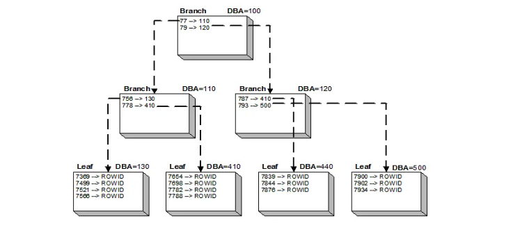
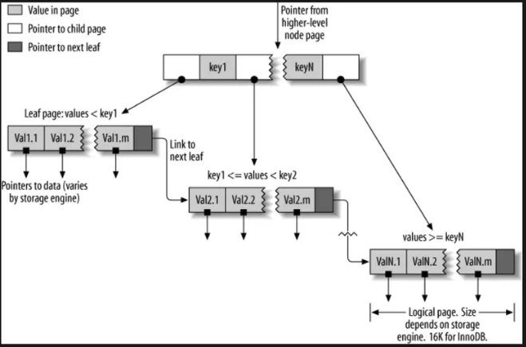
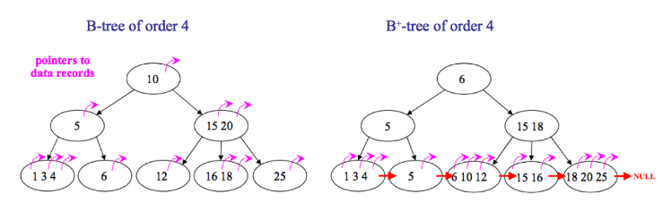
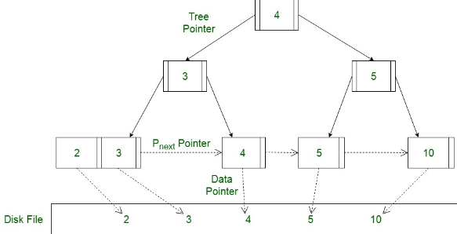

# Database

## Database Management System (DBMS)

**DBMS** is a software application that enables users to efficiently store, organize, manage, and retrieve data from database.

### File Storage

- Database store on disk as a bunch of **files**
- DBMS is the one that maintains the database files
- It organizes files as a collection of **pages**
- 
  
### Pages

- Is a **fixed-size** block of data:
  - Contain record (row + column), meta-data, indexes, .....
  - Default Pagesize:
    - MySQL: 16KB
    - SQL server, PostgreSQL: 8KB
    - MongoDB: 32KB
- In a page, all records belong to the same table
- When BDMS reads data, it reads by page
- When database save data => save into pages
- MySQL: max size of row ~ 1/2 page's size = 8KB (InnoDB engine)
- If we have 1 row contain text = 7KB => Where to store ? **Store in different space and save url into db**

### Page Layout

- Use ***Slotted page layout*** to store:
  - At the beginning of the Page, right after the Header, it store an array that contain offsets to tuple(data) => called Slot Array
  - The tuples (data) will be at the end of **Page**
  - 
  - When we need to insert a new tuple:
    - Read the starting location of the last slot used
    - Create a new slot in slot array
    - write the new tuple to the position

### Data page

- Include 2 part: ***header*** and ***data***
- Header will contain metadata:
  - Page size
  - Checksum
  - DBMS version
  - Number of empty slot
  - ....
  - 

### Heap File Organization

- Is a common way DBMS organizes database files on disk
- Each file is an **unordered** collection of pages
- A special page called **Directory page**:
  - Directory page will be at the head of the file
  - Use to keep track of the location of data pages in the file
  - Use to keep tract the number of free slots per page
  - Mapping from **Page_id** to its position(offset) in the file => increase read speed
  - 

### Buffer Pool (== Cached)

- A cache layer in memory (RAM), organized as an array of fixed-size pages
- Has Frame which **Frame's size == Page's size**
- Has Page table to map from **page_id** to **frame_id**
- DBMS use Buffer Pool to improve the performance
- When BDMS request to read a page:
  - Finds the page in **Buffer Pool**
  - If found => return
  - If not => **read from Disk**, copy to **Buffer Pool**, return
- 
- **Replacement Policies**:
  - Pool's size is limited <= RAM's size (80% RAM)
  - DBMS needs to clear a frame to make room when full
  - Replacement policies is the way it decides which page to evict from the BP:
    - FIFO
    - LRU (Least Recent Use - Implement by using HashMap + LinkedList)
    - ...

## Index

### What are indexes?

- Is a special data structure that improves the speed of data retrieval operations on a database table.
- Without index, database has to scan through the entire of table sequentially to find the matching record => Time complexity: O(n)
- But n only increase time by time, and it normal huge, can be > 1M => performance issue

### Why an index can provide faster retrieval compared to a search without an index

- **Reduced Data Access**: Database can directly locate the relevant data pages or rows containing the desired values => Doesn't need to scan the entire table => significantly reduce data access and I/O operations
- **Smaller Search Space**: The index structure provides a narrower search space => quicker identification of the desired records
- **Optimized Disk Access**: Because an index typically resides in a separate data structure, it is designed to be more compact and fit in memory => requires fewer disk I/O operations
- **Search Algorithms**: Indexes employ efficient search algorithms like binary search,... which have time complexity lower than linear => Improve retrieve performance

### Why don’t we index every column to support fast read?

Because it will have the following bad effects:

- INSERTs to the table will be slower since index must be updated
- The table's storage footprint will be larger as all these extra indexes need to be stored
- The query optimization process will be slower as there's more possible query plans to analyze (event if some not useful)

### Disadvantage

- Additional Writes operation
- Storage space to maintain the index data structure

### Index type

1. **Hash Indexes**

- Based on a Hash Table
  - **key**: **hash code** of the indexed columns
  - **value**: Pointer to the corresponding row (**page_id, slot_id**)

- ***Advantages***
  - O(1) in both reads and writes data
  - 0(1) for equality query (=, !=, IN)
- ***Disadvantages***
  - **Hash indexes store in memory**
    - Data not store close in disk => not fast while using disk => use ram to store
    - Hash indexes store in memory => key need to fit in RAM => expensive
    - RAM is not durable => need write-ahead log store in disk
    - If we're losing RAM => need to create Hash again => run all log => cost time
  - **No range queries**
    - Due to hash function => cannot compare => cannot use range queries
  - **No support partial key matching**:
    - If index(***Col1, Col2***) => not help if query only with ***Col1*** or ***Col2***
  - **Performance can bo unstable in case of hash collision**

2. **B-Tree**

- Based on a Binary Search Tree
  - Store in disk
  - Auto balanced
  - 
- B-Tree properties:
  - Self-balanced: every leaf node is at same depth
  - Each node has M-1 keys and M children
  - Each node (except root) is at least half-full: M/2 - 1 <= keys <= M - 1
  - Keys in each node are sorted
  - Leaf nodes are connected 2-ways
- **General Structure**

- **B-Tree Search**
  - Start from root, search correct child and follow the pointer
  - Because of keys are sorted => can use Binary Search
  - Runtime: ~O(logN)
- **B-Tree Insert**
  - Find the correct **Leaf node L** (Search)
  - Put the new key into L in sorted order
  - If L has enough space => done!
  - If not => split L into 2 **even** children L1 and L2, push up the middle key to L's parent. Repeat if L's parent if full
  - Runtime:
    - time to splitting key: O(M) (M: number children of current node)
    - insert time: ~ O(logN)
- **B-Tree vs B+Tree**

  - B-Tree different:
    - Inner Node can contain pointer to records
    - no duplicated key
    - leaf-node are not connected as D-Linked List
  - B+Tree over B-Tree:
    - Support full scan: 
      - Leaf nodes of B+ are linked => full scan of all objects in a tree requires just one linear pass through all the lead nodes
      - Inner node of B+ does not have a pointer to data => more keys can be packed in a B+ => reducing the tree's height

- ***Advantages***
  - Match leftmost prefix index: 
    - Index (Col1, Col2, Col3) => B+Tree index can support query on (Col1), (Col1, Col2), (Col1, Col2, Col3)
  - Match part of the first column: Index on **Name** column => B+ index can support query all records having **Name** start with letter "Qu"
  - Match a range of values (>=, >, <=, <)
  - Store on disk => not easy to lose data
- ***Disadvantages***
  - More complex than Hash indexes
  - Write speed is slower than LMS-tree indexes(SSTable)
  - Slower search than Hash index for equality query (=, !=, IN)

- ***Why use B+ for index, not BST/AVL/Red-Black Tree ?***
  - B+tree are self-balance while BST is not => can lead to a very tall tree
  - B+ are much shorter than other balanced binary tree structures such as AVL => fewer disk access
  - B+ each node contains a large number of key sorted => much more efficient than AVL, BST or Hash table for range query